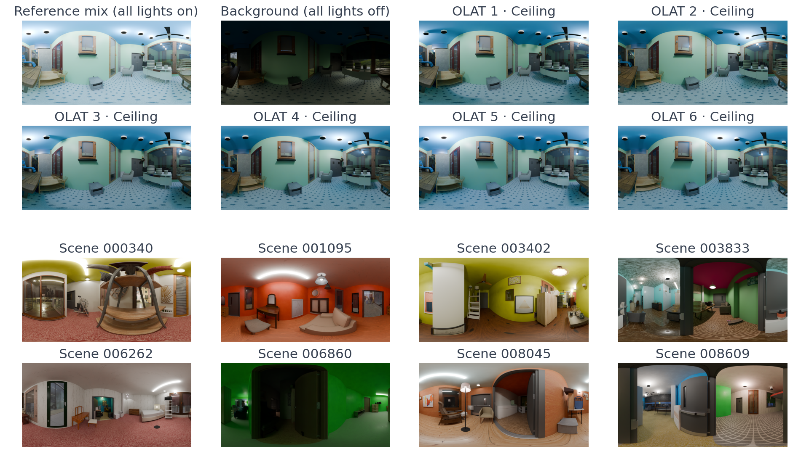

# LuxRemix Dataset

**LuxRemix: Lighting Decomposition and Remixing for Indoor Scenes**  
Ruofan Liang, Norman Müller, Ethan Weber, Duncan Zauss, Nandita Vijaykumar, Peter Kontschieder, Christian Richardt  
*CVPR 2026* · [Project page](https://luxremix.github.io) · [arXiv:2601.15283](https://arxiv.org/abs/2601.15283) · [Download](https://ai.meta.com/datasets/luxremix-dataset/)

LuxRemix is a Blender-rendered dataset of indoor scenes with per-light
decomposition (one-light-at-a-time / OLAT), produced as panoramic
equirectangular HDR. It is designed for training models that decompose and
re-mix indoor illumination from a single image.



This repository contains the tooling, reference dataloader, and
documentation needed to download, validate, and consume the released
dataset. The dataset itself is hosted at
[https://ai.meta.com/datasets/luxremix-dataset/](https://ai.meta.com/datasets/luxremix-dataset/).

## At a glance

| | |
|---|---|
| Scenes | **12,439** (12,039 training + 400 test) |
| Total files | ~1.48 M |
| Total size | ~9.7 TB |
| Shards | 1,244 tar archives (1,204 training + 40 test), ~8 GB each |
| Image resolution | 2048 × 1024 (equirectangular panorama) |
| Viewpoints per scene | 4 for ~99% of scenes; 114 have 3 views and 1 has 1 view (see [DATACARD.md](docs/DATACARD.md)) |
| Lights per scene | 2–7 (mean ~5) |
| File formats | EXR (HDR), PNG (LDR + masks), JPEG (auxiliary), JSON (metadata) |

See [FORMAT.md](docs/FORMAT.md) for the per-file layout and [DATACARD.md](docs/DATACARD.md) for composition, intended uses, and known limitations.

## Quick start

```bash
# 1. Install dependencies
pip install -r requirements.txt
git submodule update --init  # AgX OCIO config

# 2. Get the current shard URL list from the dataset portal:
#    https://ai.meta.com/datasets/luxremix-dataset/  (download `dataset-shards.txt`,
#    a TSV with header `file_name<TAB>cdn_link` and one row per shard)

# 3. Download (and unpack) one test shard as a smoke test
(head -1 dataset-shards.txt && sed -n '2p' dataset-shards.txt) > one_shard.txt
python download.py one_shard.txt --output-dir ./luxremix --split test \
    --unpack

# 4. Inspect a downloaded scene
python examples/quickstart.py ./luxremix/<scene_id>/

# 5. Iterate the reference PyTorch dataloader
python examples/training_loop.py ./luxremix/
```

For the full dataset (~9.7 TB), run step 3 against the full
`dataset-shards.txt` (drop `--unpack` if you'd rather keep tars on disk).
[USAGE.md](docs/USAGE.md) covers every flag.

## What's in this repo

| Purpose | Files |
|---|---|
| Public docs | `README.md`, `LICENSE.md`, `CITATION.cff`, `CONTRIBUTING.md`, `CODE_OF_CONDUCT.md`, `docs/{DATACARD,FORMAT,USAGE,ACKNOWLEDGMENTS}.md` |
| Download | `download.py` (HTTPS, parallel, optional unpack) |
| Reference dataloader | `dataset.py` (PyTorch `IterableDataset`), `examples/quickstart.py`, `examples/training_loop.py` |
| Perspective regeneration | `tools/generate_test_sv.py`, `tools/generate_test_mv.py`, `tools/erp_to_perspective.py`, `data/mask_strategies_*.json`, `data/camera_params_*.json` |
| Visualisation | `tools/generate_vis_grid.py` |
| Manifests | `data/shards_training.json`, `data/shards_test.json` |
| Paper evaluation cases | `data/paper_eval_cases.json` (test scenes and lights scored in Tables 1 and 2) |

## License

The LuxRemix dataset and accompanying code are released under the
**LuxRemix Dataset License Agreement**, derived from the Aria Synthetic
Environments Dataset License Agreement (see [LICENSE.md](LICENSE.md) for
the full text). Use is restricted to
**non-commercial research**; redistribution of the data is **prohibited**
without prior written permission from Meta.

## How to cite

```bibtex
@InProceedings{LuxRemix,
  author    = {Ruofan Liang and Norman M{\"u}ller and Ethan Weber and Duncan Zauss and Nandita Vijaykumar and Peter Kontschieder and Christian Richardt},
  title     = {{LuxRemix}: Lighting Decomposition and Remixing for Indoor Scenes},
  booktitle = {CVPR},
  year      = {2026},
  arxiv     = {2601.15283},
  url       = {https://luxremix.github.io},
}
```

(Also available as machine-readable [`CITATION.cff`](CITATION.cff).)

## Acknowledgments

LuxRemix builds on the Aria Synthetic Environments scenes, env maps from
Poly Haven, the Infinigen procedural-asset library, and the AgX color
science by EaryChow. See [ACKNOWLEDGMENTS.md](docs/ACKNOWLEDGMENTS.md) for
detailed attributions.
